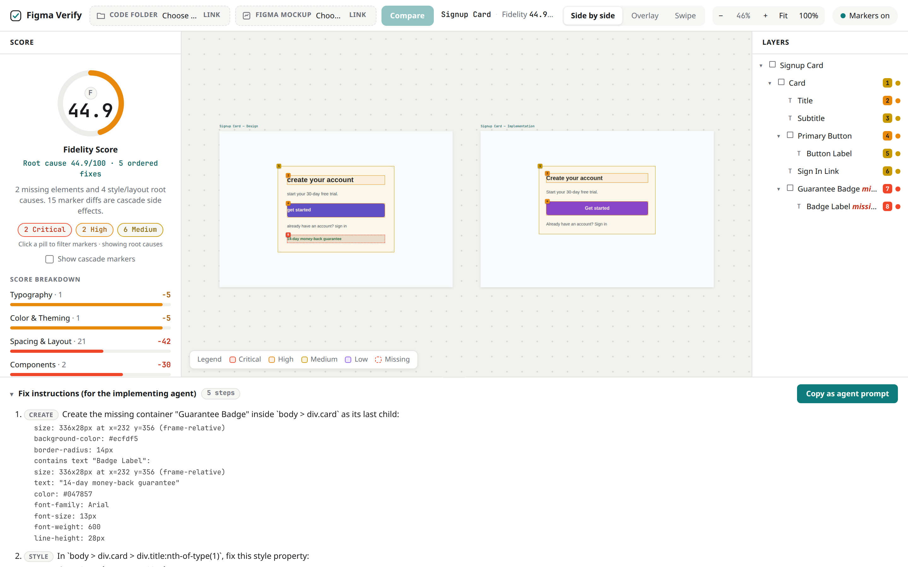
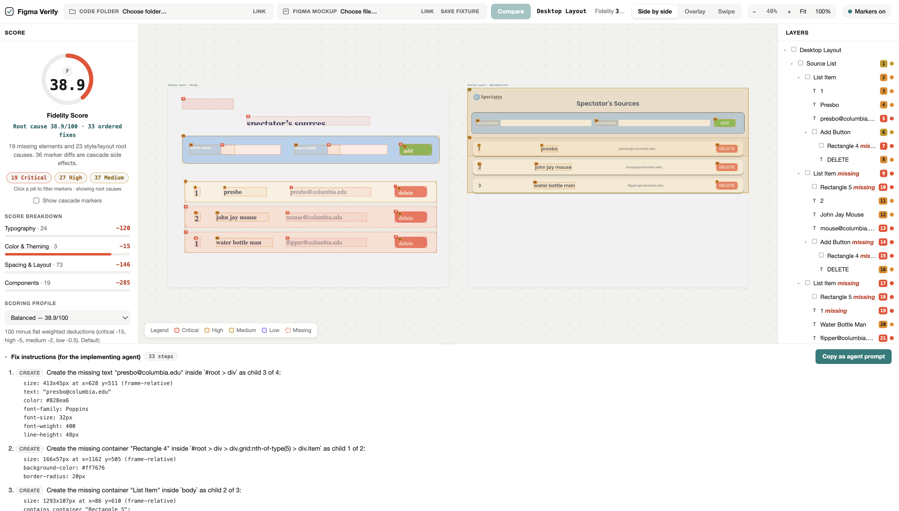

# Figma Verify

**An MCP server that lets AI agents check their code against the Figma design — and self-correct until it's pixel-perfect.**

**🔗 Live site (GitHub Pages):** [pookie2006.github.io/figma-verify](https://pookie2006.github.io/figma-verify/) — the interactive report, deployed from the [`docs/`](docs/) folder on `main`.



*Bundled Signup Card demo.*



*A real compare on the author's own [Columbia Daily Spectator](https://www.columbiaspectator.com/) work — Spectator's Sources (fidelity 38.9, 19 missing elements, 33 ordered fixes).*

For a real compare on your machine, use **Link** mode on both inserters. File upload is still a work in progress.

### How to run a compare

**1. Start your implementation on localhost** (leave this terminal open):

```bash
cd /path/to/your-app
npm start          # or: npm run dev
```

Note the URL it prints — e.g. `http://localhost:3000/` or `http://localhost:5173/your-page`.

**2. Create a Figma personal access token**

1. Open [Figma settings → Personal access tokens](https://www.figma.com/settings).
2. Generate a token (needs access to the file you will compare).
3. Copy it. You will only see the full value once.

**3. Export the token and start the studio** (a second terminal, leave it open):

```bash
# from the clone root (pookie2006/figma-verify)
cd figma-verify
npm install
npx playwright install chromium
export FIGMA_TOKEN=figd_...    # same terminal you start the studio from
npm run studio                 # report → http://127.0.0.1:4174
```

`npm run studio` from the **repo root** also works if that script exists in your checkout.

**4. Copy a Figma frame link**

In Figma, select the frame → right-click → **Copy/Paste as** → **Copy link to selection**. The URL must look like:

`https://www.figma.com/design/…/…?node-id=…`  
(or `/file/`, `/proto/`, `/board/` — same idea). A community page URL is not enough.

**5. Paste both links in the report**

Open http://127.0.0.1:4174, click **Link** on both inserters:

| Inserter | Paste |
|---|---|
| **Code folder** | your localhost URL from step 1 |
| **Figma mockup** | the Figma frame link from step 4 |

Click **Compare**.

Figma's MCP server pushes design context *into* agents, and agents generate code from it. But nothing closes the loop: no tool lets the agent **verify** that the implementation actually matches the design. Figma Verify closes that loop — the agent implements, verifies, reads the drift report, fixes its code, and re-runs until the fidelity score is 100.

```
        ┌────────────────────────────────────────────────┐
        │                    Agent loop                  │
        │                                                │
        │   implement ──► verify_implementation ──► fix  │
        │       ▲                                    │   │
        │       └────────── drift report ◄───────────┘   │
        └────────────────────────────────────────────────┘
```

## How it works

Figma Verify pulls the design's node tree from the Figma REST API and the live page's DOM + computed styles via headless Chromium (Playwright). Both sides are normalized into the same schema, matched (text anchors → container ancestry → geometry), and diffed with configurable tolerances. The result is a drift report with per-element diffs, severity levels, CSS selector hints, and a fidelity score from 0–100.

## Repository layout

All code lives in [`figma-verify/`](figma-verify/):

| Path | What it is |
|---|---|
| `figma-verify/src/` | MCP server, CLI, Figma normalization, DOM extraction, matcher, diff engine, report renderer |
| `figma-verify/tests/` | Fixture-driven unit tests plus a Playwright e2e suite |
| `figma-verify/demo/` | A deliberately flawed implementation of a design frame, with a recorded design fixture for offline runs |

## More

The GitHub repo and the npm package are both named `figma-verify`. After a clone you are in the **repo root**; `npm run studio` lives in [`figma-verify/`](figma-verify/) (the root `package.json` forwards into it). If you see `Missing script: "studio"`, `git pull origin main` and try again.

See [`figma-verify/README.md`](figma-verify/README.md) for MCP registration (Cursor, Claude Code, VS Code), the `verify_implementation` and `get_design_spec` tools, CLI usage, tolerances, and the severity model.

## License

[MIT](LICENSE)
