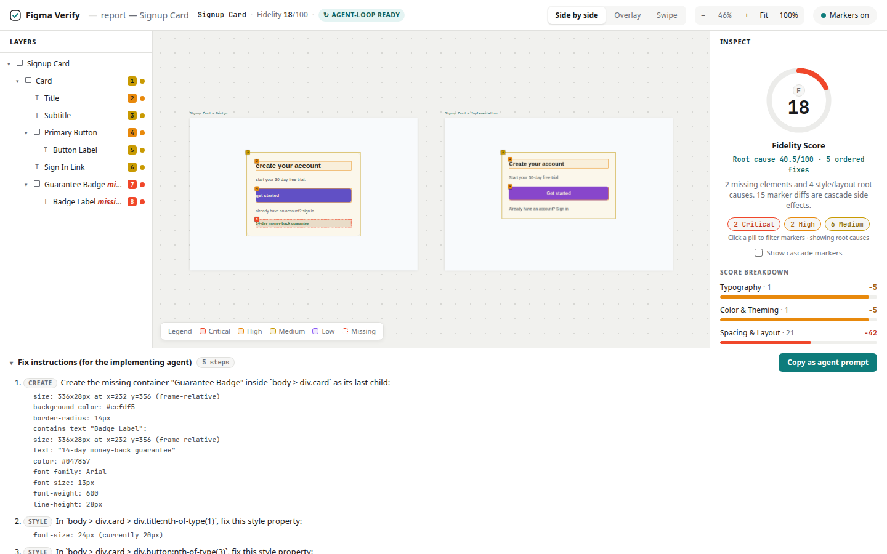
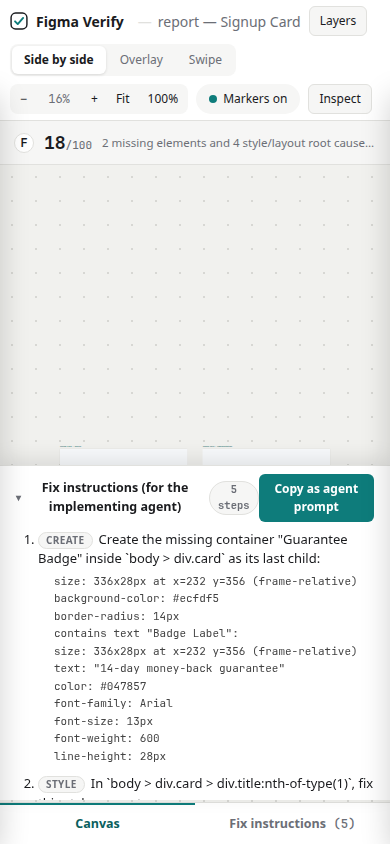

# Figma Verify

**An MCP server that lets AI agents check their code against the design — and self-correct until it's pixel-perfect.**

**🔗 Live demo:** [pookie2006.github.io/figma-verify](https://pookie2006.github.io/figma-verify/) — click around the report below without cloning anything.

## What recruiters should notice

- **It closes a real loop, not just a diff.** The output isn't a report a human reads once — it's a ranked, root-cause-first, copy-pasteable prompt an agent can act on, then re-verify against, until the score is 100. See `src/report/instructions.ts` and the "Copy as agent prompt" button in the report.
- **The scoring is opinionated and defensible.** Four scoring profiles (`balanced`/`strict`/`perElement`/`rootCause`) plus automatic cascade detection turn "1 wrong padding value → 15 derived diffs" into an honest "this is really one problem." See `src/diff/scoring.ts` and the walkthrough in the report.
- **The report is a real product surface, not a debug dump.** One self-contained HTML file — no build step, no server — with a pannable/zoomable canvas, three compare modes, a layers tree, and a live scoring-formula switcher, restyled to be legible in one glance and usable down to a 390px phone. See `src/report/render-html.ts` and the screenshots below.

## The gap

Figma's MCP server pushes design context *into* agents (`get_code`, `get_variable_defs`), and agents generate code from it. But nothing closes the loop: no tool lets the agent **verify** that the implementation actually matches the design. Existing comparison tools (Pixelay, Uiprobe, OverlayQA) are human-facing browser overlays — none are callable by an agent.

Figma Verify closes the loop. The agent implements, verifies, reads the drift report, fixes its code, and re-runs until the fidelity score is 100.

```
        ┌────────────────────────────────────────────────┐
        │                    Agent loop                  │
        │                                                │
        │   implement ──► verify_implementation ──► fix  │
        │       ▲                                    │   │
        │       └────────── drift report ◄───────────┘   │
        └────────────────────────────────────────────────┘
```


*Generated by `npm run demo:open` from the flawed demo page below — every pixel of this UI is real output, not a mockup.*

<details>
<summary>Mobile view (390px)</summary>



</details>

## Architecture

```
 Figma share URL                          Live URL
       │                                     │
       ▼                                     ▼
┌───────────────┐                   ┌──────────────────┐
│ Figma REST API│                   │ Playwright       │
│ /files/:key/  │                   │ (headless        │
│ nodes         │                   │  Chromium)       │
└──────┬────────┘                   └────────┬─────────┘
       │ node tree                           │ DOM + computed styles
       ▼                                     ▼
┌───────────────┐                   ┌──────────────────┐
│ normalize.ts  │                   │ extract.ts       │
└──────┬────────┘                   └────────┬─────────┘
       │        NormalizedElement[]          │
       └────────────────┬────────────────────┘
                        ▼
              ┌──────────────────┐
              │ matcher.ts       │  text anchors → container LCA → geometry IoU
              └────────┬─────────┘
                       ▼
              ┌──────────────────┐
              │ diff.ts          │  tolerances + severity + cascade tagging
              └────────┬─────────┘
                       ▼
              ┌──────────────────┐
              │ scoring.ts       │  4 scoring profiles, fidelity 0–100
              └────────┬─────────┘
                       ▼
         ┌─────────────┴─────────────┐
         ▼                           ▼
┌──────────────────┐        ┌──────────────────┐
│ render.ts        │        │ render-html.ts   │
│ markdown + JSON  │        │ self-contained   │
│ drift report     │        │ visual report    │
└──────────────────┘        └──────────────────┘
```

Both sources reduce to the same normalized schema — every element becomes
`{ id, role, name, text?, bounds (frame-relative), styles { colors, typography, padding, gap, radius, … } }` —
so matching and diffing are source-agnostic.

### Matching (v1 scope: auto-layout frames)

1. **Text anchors first.** Unique normalized text strings pair design text nodes to DOM text elements directly.
2. **Containers by children.** A design container maps to the lowest common ancestor of its matched text children in the DOM, ties broken by bounding-box IoU.
3. **Leftovers by geometry.** Remaining nodes match greedily on IoU + role above a floor (0.4); below it, the design node is reported **missing** (critical).

The browser viewport width is set to the Figma frame width so coordinates compare 1:1.

### Severity model

| Severity | Meaning | Score deduction |
|---|---|---|
| critical | missing element, wrong text content | −15 |
| high | color, fontFamily, fontWeight, fontSize drift | −5 |
| medium | spacing / size / radius beyond tolerance | −2 |
| low | beyond tolerance but within 2× (noted, not failed) | −0.5 |

Default tolerances: position/size ±2px, spacing/padding/gap ±1px, fontSize ±0.5px, colors compared by RGB distance. All configurable per call.

### Scoring profiles

Every run computes the score under four profiles; **balanced** is the standardized default (comparable run-to-run, which matters for the agent loop), and you pick which one gates pass/fail via `--scoring` (CLI) or `scoring` (MCP):

| Profile | Formula | Use when |
|---|---|---|
| `balanced` (default) | 100 − flat weighted deductions | General purpose; agent iteration loop |
| `strict` | balanced, but any critical caps the score at 40, any high at 75 | CI release gates — missing elements can never average out |
| `perElement` | each element scored 0–100 on its own diffs (missing = 0); final = mean | Large pages, where one broken element shouldn't tank the score |
| `rootCause` | balanced, but cascade diffs count at 25% weight | Triage — see how many *distinct* problems there really are |

**Cascades:** when a parent's padding/gap/size drifts, every child shifts with it. Those child position diffs are tagged `cascade` in the report and discounted by the `rootCause` profile — in the demo, one wrong padding value produces 15 derived diffs; balanced scores it 18/100 while rootCause scores 40.5/100, telling you it's really ~5 problems, not 25.

### Visual HTML report

Pass `--html <path>` (CLI) or `html_report_path` (MCP) to also emit a **self-contained interactive HTML report** — a single file with zero external resources (inline CSS/JS/JSON, no CDN fonts or scripts) that you can open anywhere or attach to a PR.

The information architecture is built to answer "is this good?" in one glance, then let you dig in:

1. **Fidelity score** for the currently active scoring profile, in a circular gauge with a letter grade.
2. **A root-cause companion line** — `Root cause X/100 · N ordered fixes` — so a low balanced score caused by 15 cascade diffs doesn't read as 15 separate problems.
3. **A one-sentence plain-English summary**, e.g. *"2 missing elements and 4 style/layout root causes. 15 marker diffs are cascade side effects."*
4. **Severity pills** that count root causes by default (a "Show cascade markers" toggle switches to the raw count), and double as marker filters.
5. **Fix instructions**, open by default whenever there's anything to fix, collapsed only at a perfect score.
6. **Score walkthrough**, leading with root-cause deductions and folding the cascade diffs into one collapsible group instead of a wall of `−2` lines.

Underneath that: a pannable/zoomable canvas with the design (painted from the normalized Figma spec) and the implementation (real screenshot) as floating frames, three compare modes (side by side, onion-skin overlay with an opacity slider, and a draggable swipe split), a Figma-style layers tree, and a per-element inspector with click-to-copy expected CSS values and a redline "expected" ghost on the implementation frame.

The layout is responsive: ≥1200px shows the full three-pane workspace; 800–1199px turns the layers/inspect panels into toolbar-triggered overlay drawers so the canvas stays primary; below 800px it becomes a single column with a sticky score header and a Canvas/Fix-instructions tab bar. The canvas is never allowed to shrink to zero width. Accessibility touches: a single page `<h1>`, an accessible radiogroup for the compare-mode toggle, ARIA slider roles on the swipe handle, meaningful alt text on the implementation screenshot, `prefers-reduced-motion` support, and visible focus rings throughout.

```bash
npm run demo:report   # generates demo/report.html from the fixture demo
npm run demo:open     # generates it and prints/opens its file:// URL
```

### Agent fix instructions

Every report ends with **ordered, imperative fix instructions** designed to be fed straight back to the AI agent that implemented the design — closing the loop when both sides are automated:

1. **create** — missing elements first, with the complete spec (size, position, colors, typography, children) so the agent needs nothing but the instruction
2. **text** — wrong text content, with the exact expected string
3. **style** — color/typography fixes as ready-to-apply CSS (`background-color: #4f46e5  (currently #7c3aed)`)
4. **layout** — padding/gap/radius fixes (equal padding sides collapse to shorthand), each noting how many cascade diffs it also resolves
5. **geometry** — residual box drift last, flagged "re-verify before hand-tuning" since it usually disappears once the steps above are applied

Cascade diffs never become instructions — fixing the root cause fixes them. Available everywhere: the markdown report (`## Fix instructions`), the JSON (`report.fixInstructions`, structured), the CLI (`--instructions` prints only the list), and the HTML report (panel with a **Copy as agent prompt** button that produces a paste-ready prompt).

Validated end-to-end: applying only the generated instructions to the demo's flawed page takes it from 18/100 to 100/100.

## Quickstart

```bash
git clone <this-repo> && cd figma-verify
npm install
npx playwright install chromium
```

Get a Figma personal access token at [figma.com/settings](https://www.figma.com/settings) (Security → Personal access tokens) and export it:

```bash
export FIGMA_TOKEN=figd_...
```

### Register in Cursor

Add to `.cursor/mcp.json` (project) or `~/.cursor/mcp.json` (global):

```json
{
  "mcpServers": {
    "figma-verify": {
      "command": "npx",
      "args": ["tsx", "/absolute/path/to/figma-verify/src/index.ts"],
      "env": { "FIGMA_TOKEN": "figd_..." }
    }
  }
}
```

Also works in Claude Code (`claude mcp add`) and VS Code — anything that speaks MCP over stdio.

### MCP tools

- **`verify_implementation({ figma_url, live_url, viewport_width?, tolerances?, scoring?, html_report_path? })`** — full drift report: markdown summary plus JSON with per-element diffs (property, expected, actual, severity, CSS selector hint so the agent can locate the element to fix). Optionally writes the visual HTML report.
- **`get_design_spec({ figma_url })`** — just the normalized design spec, for inspecting the target before/without diffing.

`figma_url` is a "Copy link to selection" URL — it must contain `?node-id=...`.

### CLI (for demos and debugging)

```bash
# Against the real Figma API:
npm run cli -- "https://www.figma.com/design/KEY/name?node-id=1-2" http://localhost:5173

# Offline, using the recorded fixture (no token needed):
npm run cli -- --fixture demo/design-fixture.json "file://$PWD/demo/index.html"

# With the visual report and a different scoring profile:
npm run cli -- --fixture demo/design-fixture.json "file://$PWD/demo/index.html" \
  --html report.html --scoring rootCause
```

Options: `--viewport <px>`, `--scoring balanced|strict|perElement|rootCause`, `--html <path>`, `--json`.
Exit code 0 = fidelity 100, 1 = drift found, 2 = error.

## Demo

`demo/index.html` is a deliberately flawed implementation of the `Signup Card` design frame (recorded in `demo/design-fixture.json`). Five flaws are planted:

1. Wrong brand color on the button (`#7c3aed` instead of `#4f46e5`) — **high**
2. Wrong title font size (20px instead of 24px) — **high**
3. Missing element (the guarantee badge) — **critical**
4. Wrong card padding (24px instead of 32px) — **medium**
5. Wrong card border radius (8px instead of 16px) — **medium**

Run the CLI as above and watch the report catch all five. Point an agent at the report and it fixes the page; re-run until the score is 100.

## Deployment

**Live demo:** [pookie2006.github.io/figma-verify](https://pookie2006.github.io/figma-verify/)

There are two ways the site gets published (pick either):

### Option A — GitHub Actions (preferred)

Every push to `main` that touches `figma-verify/` regenerates the demo report and publishes it via [`.github/workflows/deploy-pages.yml`](../.github/workflows/deploy-pages.yml).

**One-time enable (required — the first Actions deploy will 404 until this is done):**

1. Open [Settings → Pages](https://github.com/pookie2006/figma-verify/settings/pages)
2. Under **Build and deployment → Source**, choose **GitHub Actions**
3. Re-run the failed workflow: [Actions → Deploy demo to GitHub Pages](https://github.com/pookie2006/figma-verify/actions/workflows/deploy-pages.yml) → *Re-run jobs*

### Option B — Deploy from the committed `docs/` folder

A pre-built copy of the demo site is checked into [`docs/`](../docs/) at the repo root. On [Settings → Pages](https://github.com/pookie2006/figma-verify/settings/pages), set Source to **Deploy from a branch**, Branch to `main`, Folder to `/docs`, then Save. The same URL goes live within a minute — no Actions needed.

The published site opens straight into the interactive report (`index.html` / `report.html`). Supporting pages:

- `demo-implementation.html` — the flawed page it's scoring
- `design-reference.html` — a pixel-faithful reference build

### Live compare from the report UI

The GitHub Pages demo is static (it can’t run Playwright). For a real upload-driven compare:

```bash
cd figma-verify
npm run studio          # http://127.0.0.1:4174
```

1. **Code folder** — either:
   - Click **Link** and paste a **running dev server URL** (e.g. `http://localhost:3000/search-page`) — no upload at all, Playwright just navigates there directly. This is the simplest option if your app is already running (`npm start`), and sidesteps upload-size/permission issues entirely, or
   - Click **File** and select the folder that contains your **built/static** implementation (`index.html` plus CSS/JS assets — e.g. a React/Vite app's `build/` or `dist/` output after `npm run build`, not the raw `src/`). `node_modules`, `.git`, and similar are excluded automatically; uploads are capped at 80MB / 4000 files so a whole project can't crash the studio server.
2. **Figma mockup** — either:
   - Click **Link** and paste a Figma URL — `design`, `file`, `proto`, or `board`, e.g. `https://www.figma.com/proto/KEY/name?node-id=1601-3`. Needs `FIGMA_TOKEN` set before starting the studio (`export FIGMA_TOKEN=...`, from [figma.com/settings](https://www.figma.com/settings) → Personal access tokens), or
   - Click **File** and upload a **nodes-API fixture JSON** (same shape as `demo/design-fixture.json`) — works offline, no token needed.

   Images are preview-only and cannot drive the structural score.
3. Click **Compare** — the studio serves the folder, fetches/normalizes the design (from the link or fixture), extracts the live DOM, diffs the two, and reloads the report with the new score / fix instructions.

CLI/MCP remain the headless path (`--fixture` + live URL, or a Figma URL + `FIGMA_TOKEN`).

## Tests

```bash
npm test
```

Fixture-driven; no network and no `FIGMA_TOKEN` required. The e2e suite spins up a local static server for the demo page and needs Playwright's Chromium.

## Honest v1 limitations

- **Auto-layout frames only.** Free-floating/absolute Figma layouts still diff, but position noise makes reports less useful.
- **Single viewport.** One frame = one width; responsive behavior isn't checked (run per-breakpoint frame instead).
- **No visual pixel diff.** Comparison is structural (computed styles), so gradients, shadows, image content, and blend modes aren't compared yet.
- **Max corner radius only** when Figma corners differ per-corner.
- **Text matching assumes reasonably unique strings.** Heavily repeated text (e.g. ten identical "Edit" buttons) falls back to geometric disambiguation.
- **Component states** (hover, pressed) aren't exercised — only the initial render.

## License

MIT
